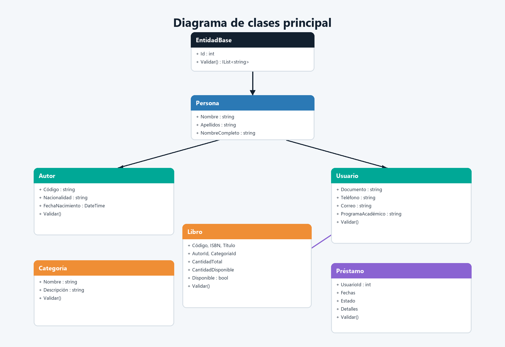
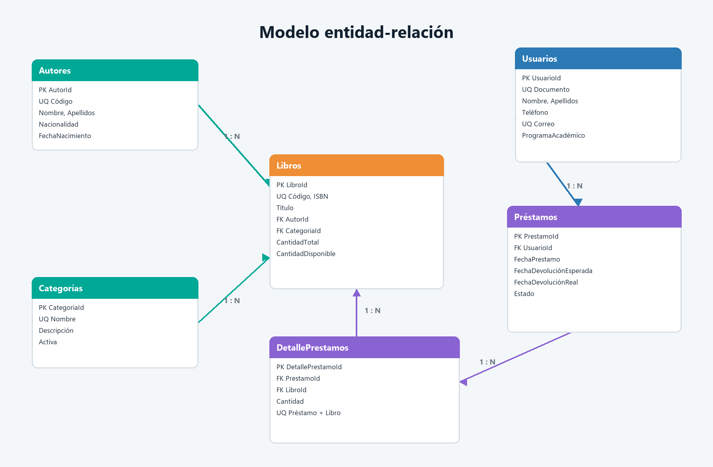
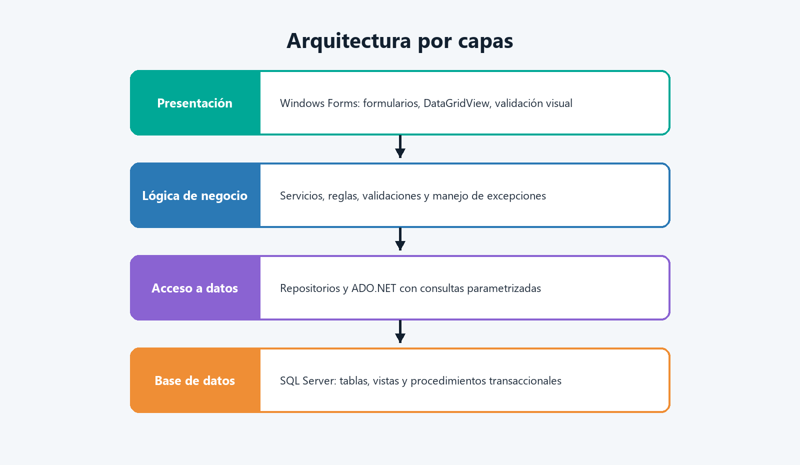
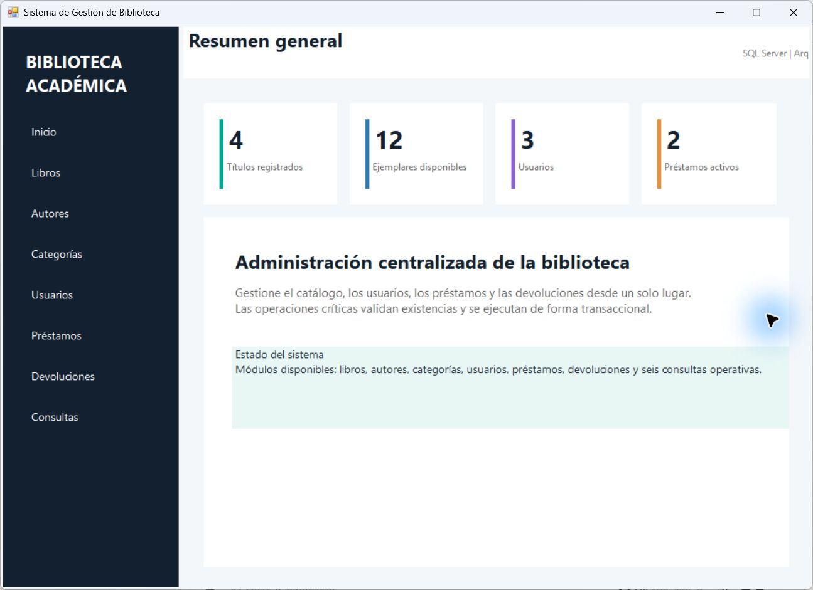
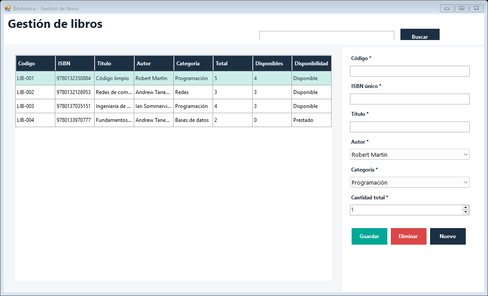
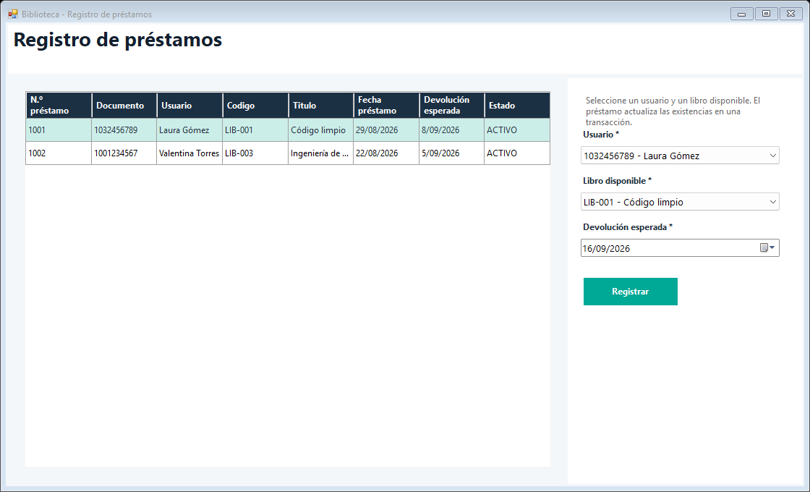
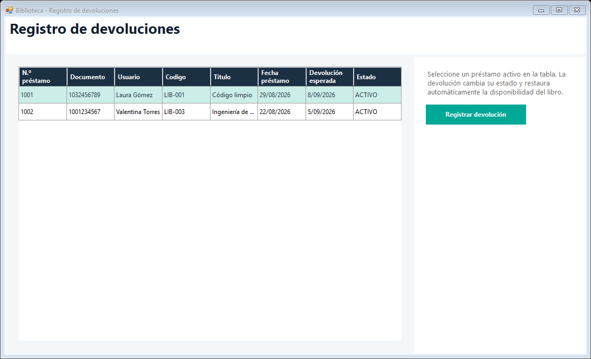
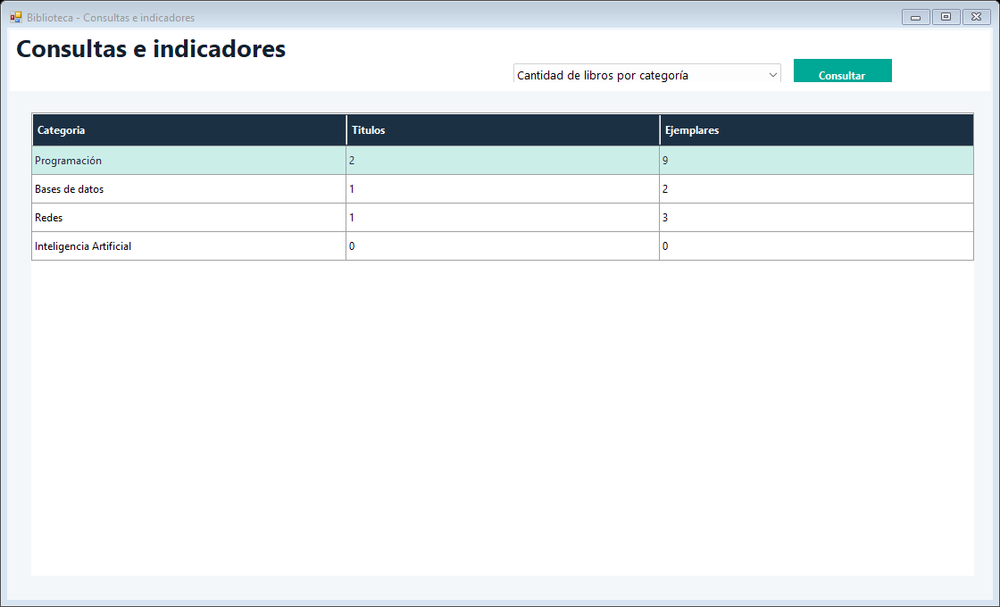

<div align="center">

# SISTEMA DE GESTIÓN DE BIBLIOTECA

## Proyecto final - Programación Avanzada

**Sindy Yulieth Arroyave Pérez**  **53304**

**Juan Carlos Alonso Rincon**

**Aplicación de escritorio con C#, Windows Forms y SQL Server**

**Informe técnico y funcional**

**Docente: Veronica Castro Munar**

**Enlace al repositorio oficial en GitHub**

https://github.com/sindy-arroyave/GESTIOON-BIBLIOTECA-2026

**Corporacion Unificada Nacional de Educacion Superior CUN**

Versión 1.0  
Septiembre 2026

</div>

<div align="right"><sub>Página 1</sub></div>

<div style="page-break-after: always;"></div>

# Contraportada

**Título:** Sistema de Gestión de Biblioteca  
**Asignatura:** Programación Avanzada  
**Tipo de entrega:** Proyecto final  
**Tecnologías:** C#, Windows Forms, ADO.NET, SQL Server, Git y GitHub  
**Arquitectura:** Presentación, Lógica de Negocio, Acceso a Datos y Base de Datos  
**Propósito:** Automatizar la administración de libros, autores, categorías, usuarios, préstamos y devoluciones de una biblioteca académica.

El presente documento describe el análisis, diseño, implementación y verificación de una solución de escritorio orientada a objetos. El repositorio que acompaña este informe contiene la solución de Visual Studio, el script de base de datos, los datos de prueba, las capturas generadas desde la aplicación compilada y la evidencia de control de versiones.

<div align="right"><sub>Página 2</sub></div>

<div style="page-break-after: always;"></div>

# Tabla de contenido

1. [Introducción](#1-introducción)
2. [Objetivos](#2-objetivos)
3. [Planteamiento del problema](#3-planteamiento-del-problema)
4. [Alcance](#4-alcance)
5. [Análisis de requerimientos](#5-análisis-de-requerimientos)
6. [Casos de uso](#6-casos-de-uso)
7. [Diagrama de clases](#7-diagrama-de-clases)
8. [Modelo entidad-relación](#8-modelo-entidad-relación)
9. [Diccionario de datos](#9-diccionario-de-datos)
10. [Arquitectura del sistema](#10-arquitectura-del-sistema)
11. [Módulos desarrollados](#11-módulos-desarrollados)
12. [Validaciones y manejo de errores](#12-validaciones-y-manejo-de-errores)
13. [Capturas del sistema](#13-capturas-del-sistema)
14. [Pruebas de funcionamiento](#14-pruebas-de-funcionamiento)
15. [Trazabilidad](#15-trazabilidad)
16. [Conclusiones](#16-conclusiones)
17. [Recomendaciones](#17-recomendaciones)
18. [Referencias](#18-referencias)


<div align="right"><sub>Página 3</sub></div>

<div style="page-break-after: always;"></div>

# 1. Introducción

Las bibliotecas académicas administran información que cambia constantemente: nuevos libros, autores, categorías, estudiantes, préstamos en curso y devoluciones. Cuando esos registros se llevan de forma manual, se incrementa la posibilidad de duplicados, pérdida de datos, préstamos sin trazabilidad e inconsistencias entre la existencia física y la disponibilidad reportada.

Este proyecto desarrolla una aplicación de escritorio para centralizar dicho proceso. La interfaz Windows Forms ofrece operaciones CRUD y consultas; la capa de negocio aplica reglas y valida las entradas; la capa de datos ejecuta consultas parametrizadas con ADO.NET; y SQL Server conserva la información mediante llaves, restricciones, vistas y procedimientos transaccionales.

La solución prioriza tres atributos: integridad, claridad y mantenibilidad. La integridad se protege en la interfaz, el negocio y la base de datos; la claridad se refleja en formularios con mensajes directos; y la mantenibilidad se favorece mediante separación por capas, clases con responsabilidades delimitadas, nombres descriptivos y un proceso de compilación y pruebas reproducible.

<div align="right"><sub>Página 4</sub></div>

<div style="page-break-after: always;"></div>

# 2. Objetivos

## 2.1 Objetivo general

Desarrollar una aplicación de escritorio utilizando C# y SQL Server que permita gestionar los procesos principales de una biblioteca mediante la aplicación de programación orientada a objetos y conexión a bases de datos.

## 2.2 Objetivos específicos

- Aplicar clases, objetos, constructores, encapsulamiento, propiedades, métodos, herencia y colecciones.
- Diseñar una base de datos relacional con llaves primarias, foráneas, relaciones y restricciones de integridad.
- Implementar operaciones CRUD para libros, autores, categorías y usuarios.
- Registrar préstamos y devoluciones con actualización automática de existencias.
- Implementar búsquedas y consultas operativas.
- Separar la solución en capas de presentación, negocio, datos y persistencia.
- Validar información y mostrar mensajes claros ante datos inválidos o duplicados.
- Manejar excepciones sin exponer detalles técnicos innecesarios al usuario.
- Utilizar Git para registrar la evolución del proyecto y preparar su publicación en GitHub.
- Documentar el análisis, el diseño, la implementación y las pruebas.

<div align="right"><sub>Página 5</sub></div>

<div style="page-break-after: always;"></div>

# 3. Planteamiento del problema

Una institución educativa realiza manualmente el registro de libros, estudiantes, préstamos y devoluciones. Esta práctica produce cuatro riesgos principales:

1. **Pérdida de información:** los registros físicos o aislados pueden extraviarse y no existe una fuente central confiable.
2. **Errores de consistencia:** un libro puede aparecer disponible aunque tenga un préstamo activo, o puede devolverse sin actualizar su existencia.
3. **Duplicidad:** códigos, ISBN, documentos o categorías pueden registrarse más de una vez.
4. **Dificultad de consulta:** conocer el historial, los usuarios con préstamos o la cantidad de libros por categoría exige revisar múltiples registros manuales.

La solución propuesta centraliza la información y hace que cada operación respete reglas verificables. En particular, el préstamo solo se confirma si el usuario y el libro existen y hay disponibilidad; la devolución actualiza el estado y las existencias dentro de una misma transacción; y las restricciones únicas impiden duplicados aun si una validación de interfaz fuera omitida.

# 4. Alcance

El sistema incluye:

- libros, autores, categorías y usuarios;
- préstamos y devoluciones;
- búsquedas y seis consultas operativas;
- validaciones, restricciones y manejo de excepciones;
- interfaz Windows Forms;
- base de datos SQL Server y datos de demostración;
- documentación, pruebas y repositorio Git.

Quedan fuera del alcance, por indicación del enunciado, la autenticación por roles y las funcionalidades de pago. El sistema no calcula multas ni procesa cobros.

<div align="right"><sub>Página 6</sub></div>

<div style="page-break-after: always;"></div>

# 5. Análisis de requerimientos

## 5.1 Requerimientos funcionales

| Código | Requerimiento | Criterio de aceptación | Implementación |
|---|---|---|---|
| RF01 | Gestionar libros | Crear, consultar, editar y eliminar; buscar por código, título, autor o categoría; mostrar disponibilidad | `LibrosForm`, `LibroServicio`, `LibroRepositorio` |
| RF02 | Gestionar autores | Almacenar código, nombres, apellidos, nacionalidad y nacimiento | `AutoresForm`, `AutorServicio`, `AutorRepositorio` |
| RF03 | Gestionar categorías | Administrar las categorías sugeridas y otras nuevas | `CategoriasForm`, tabla `Categorias` y datos iniciales |
| RF04 | Gestionar usuarios | Registrar documento, nombres, teléfono, correo y programa académico | `UsuariosForm`, `UsuarioServicio`, `UsuarioRepositorio` |
| RF05 | Registrar préstamos | Asociar usuario, libro, fecha, devolución esperada y estado | `PrestamosForm` y `sp_RegistrarPrestamo` |
| RF06 | Registrar devoluciones | Cambiar estado y restaurar disponibilidad automáticamente | `DevolucionesForm` y `sp_RegistrarDevolucion` |
| RF07 | Ejecutar consultas | Disponibles, prestados, usuarios con préstamos, historial, libros por categoría y total prestado | `ConsultasForm`, vistas y `ConsultaRepositorio` |

## 5.2 Requerimientos no funcionales

| Código | Requerimiento | Respuesta de diseño |
|---|---|---|
| RNF01 | Interfaz amigable | Navegación lateral, títulos visibles, colores consistentes, formularios agrupados y tablas de lectura |
| RNF02 | Validar todos los campos | Validación de entidades, servicios y restricciones `CHECK`, `NOT NULL` y `UNIQUE` |
| RNF03 | No permitir duplicados | Índices y restricciones únicas para código, ISBN, documento, correo y categoría |
| RNF04 | Mensajes claros | Traducción de errores de validación, duplicidad, referencias y conexión |
| RNF05 | Manejo de errores | `try/catch` en presentación y transacciones con `TRY/CATCH`, `XACT_ABORT` y `ROLLBACK` en SQL |
| RNF06 | Código organizado | Solución de cuatro proyectos, namespaces por capa y scripts separados |
| RNF07 | Nombres descriptivos | Clases, métodos, propiedades, controles y objetos SQL con nombres de negocio |

## 5.3 Reglas de negocio

- El código del libro, el ISBN, el título, el autor, la categoría y la cantidad son obligatorios.
- El ISBN debe tener 10 o 13 dígitos y ser único.
- La cantidad total debe ser mayor que cero y nunca puede dejar la disponibilidad por debajo de cero.
- El documento y el correo de un usuario deben ser únicos.
- El correo y el teléfono deben cumplir un formato válido.
- No se puede prestar a un usuario inexistente o inactivo.
- No se puede prestar un libro inexistente, inactivo o sin disponibilidad.
- La devolución esperada no puede ser anterior a la fecha del préstamo.
- Un préstamo devuelto no puede devolverse nuevamente.
- Préstamo, detalle y disminución de existencias se confirman o revierten como una sola unidad.

<div align="right"><sub>Página 7</sub></div>

<div style="page-break-after: always;"></div>

# 6. Casos de uso

## CU01. Administrar libro

| Elemento | Descripción |
|---|---|
| Actor | Encargado de biblioteca |
| Precondiciones | Autor y categoría registrados |
| Flujo principal | Abrir Libros; ingresar código, ISBN, título, autor, categoría y cantidad; guardar; actualizar tabla |
| Alternos | Editar fila seleccionada; buscar por texto; eliminar si no tiene relaciones |
| Excepciones | Datos incompletos, ISBN inválido o duplicado, cantidad menor que ejemplares prestados |
| Postcondición | Catálogo y disponibilidad quedan consistentes |

## CU02. Administrar autor o categoría

| Elemento | Descripción |
|---|---|
| Actor | Encargado de biblioteca |
| Precondiciones | Aplicación conectada |
| Flujo principal | Seleccionar módulo, completar datos y guardar |
| Alternos | Seleccionar una fila para editar o eliminar |
| Excepciones | Código o nombre duplicado; registro relacionado con libros |
| Postcondición | Catálogo auxiliar actualizado |

## CU03. Administrar usuario

| Elemento | Descripción |
|---|---|
| Actor | Encargado de biblioteca |
| Precondiciones | Aplicación conectada |
| Flujo principal | Ingresar documento, nombres, teléfono, correo y programa; guardar |
| Alternos | Editar o eliminar usuario sin préstamos relacionados |
| Excepciones | Documento/correo duplicado; formato de correo o teléfono inválido |
| Postcondición | Usuario disponible para préstamos |

## CU04. Registrar préstamo

| Elemento | Descripción |
|---|---|
| Actor | Encargado de biblioteca |
| Precondiciones | Usuario activo; libro activo con al menos un ejemplar; fecha válida |
| Flujo principal | Seleccionar usuario, libro y devolución esperada; confirmar; ejecutar transacción |
| Alternos | Elegir otro libro disponible |
| Excepciones | Usuario/libro inexistente, libro sin existencias o fecha anterior a hoy |
| Postcondición | Préstamo activo, detalle creado y disponibilidad reducida en uno |

## CU05. Registrar devolución

| Elemento | Descripción |
|---|---|
| Actor | Encargado de biblioteca |
| Precondiciones | Préstamo activo seleccionado |
| Flujo principal | Seleccionar préstamo; registrar devolución; ejecutar transacción |
| Excepciones | Préstamo inexistente o ya devuelto |
| Postcondición | Estado `DEVUELTO`, fecha real registrada y disponibilidad restaurada |

## CU06. Consultar información

| Elemento | Descripción |
|---|---|
| Actor | Encargado o personal académico |
| Precondiciones | Base de datos disponible |
| Flujo principal | Elegir tipo de consulta y presionar Consultar |
| Resultado | Tabla actualizada sin modificar datos |

<div align="right"><sub>Página 8</sub></div>

<div style="page-break-after: always;"></div>

# 7. Diagrama de clases



El modelo aplica programación orientada a objetos de la siguiente forma:

- `EntidadBase` encapsula el identificador y define polimórficamente `Validar()`.
- `Persona` concentra nombres, apellidos y nombre completo.
- `Autor` y `Usuario` heredan de `Persona` y especializan sus propiedades y validaciones.
- `Libro`, `Categoria` y `Prestamo` heredan de `EntidadBase`.
- `Prestamo` contiene una colección de `DetallePrestamo`, demostrando composición y colecciones.
- Cada entidad controla su estado mediante propiedades públicas y reglas de validación, mientras los servicios coordinan las operaciones.

La clase abstracta y la interfaz `IValidable` permiten tratar distintos objetos mediante el mismo contrato; por ello el método `Validador.LanzarSiHayErrores` recibe cualquier objeto válido del dominio sin acoplarse a una clase concreta.

<div align="right"><sub>Página 9</sub></div>

<div style="page-break-after: always;"></div>

# 8. Modelo entidad-relación



## 8.1 Cardinalidades

- Un autor puede escribir muchos libros; cada libro referencia un autor.
- Una categoría puede clasificar muchos libros; cada libro pertenece a una categoría.
- Un usuario puede tener muchos préstamos; cada préstamo corresponde a un usuario.
- Un préstamo puede contener muchos detalles; cada detalle pertenece a un préstamo.
- Un libro puede aparecer en muchos detalles históricos; cada detalle referencia un libro.
- Un préstamo puede tener cero o una devolución; la tabla `Devoluciones` conserva la evidencia de la operación.

Las relaciones usan llaves foráneas sin borrado en cascada. Esta decisión evita eliminar accidentalmente información histórica: si un autor, libro o usuario tiene relaciones, SQL Server rechaza su eliminación y la aplicación muestra un mensaje comprensible.

<div align="right"><sub>Página 10</sub></div>

<div style="page-break-after: always;"></div>

# 9. Diccionario de datos

Abreviaturas: **PK** llave primaria, **FK** llave foránea, **UQ** valor único, **NN** no nulo.

## 9.1 Tabla Autores

| Campo | Tipo | Restricción | Descripción |
|---|---|---|---|
| AutorId | `INT IDENTITY` | PK, NN | Identificador interno |
| Codigo | `VARCHAR(20)` | UQ, NN | Código institucional del autor |
| Nombre | `NVARCHAR(80)` | NN | Nombres |
| Apellidos | `NVARCHAR(100)` | NN | Apellidos |
| Nacionalidad | `NVARCHAR(80)` | Opcional | Nacionalidad |
| FechaNacimiento | `DATE` | NN, no futura | Fecha de nacimiento |
| FechaRegistro | `DATETIME2(0)` | NN, valor automático | Auditoría de creación |

## 9.2 Tabla Categorias

| Campo | Tipo | Restricción | Descripción |
|---|---|---|---|
| CategoriaId | `INT IDENTITY` | PK, NN | Identificador interno |
| Nombre | `NVARCHAR(80)` | UQ, NN | Nombre de la categoría |
| Descripcion | `NVARCHAR(250)` | Opcional | Alcance de la categoría |
| Activa | `BIT` | NN, predeterminado 1 | Estado lógico |

## 9.3 Tabla Usuarios

| Campo | Tipo | Restricción | Descripción |
|---|---|---|---|
| UsuarioId | `INT IDENTITY` | PK, NN | Identificador interno |
| Documento | `VARCHAR(25)` | UQ, NN | Documento del usuario |
| Nombre | `NVARCHAR(80)` | NN | Nombres |
| Apellidos | `NVARCHAR(100)` | NN | Apellidos |
| Telefono | `VARCHAR(20)` | NN, longitud 7-20 | Teléfono de contacto |
| Correo | `VARCHAR(150)` | UQ, NN, formato básico | Correo electrónico |
| ProgramaAcademico | `NVARCHAR(120)` | NN | Programa académico |
| Activo | `BIT` | NN, predeterminado 1 | Habilitación para préstamos |
| FechaRegistro | `DATETIME2(0)` | NN, automático | Auditoría de creación |

<div align="right"><sub>Página 11</sub></div>

<div style="page-break-after: always;"></div>

## 9.4 Tabla Libros

| Campo | Tipo | Restricción | Descripción |
|---|---|---|---|
| LibroId | `INT IDENTITY` | PK, NN | Identificador interno |
| Codigo | `VARCHAR(20)` | UQ, NN | Código de inventario |
| ISBN | `VARCHAR(20)` | UQ, NN, 10/13 dígitos | Identificador bibliográfico |
| Titulo | `NVARCHAR(200)` | NN | Título del libro |
| AutorId | `INT` | FK, NN | Autor principal |
| CategoriaId | `INT` | FK, NN | Categoría |
| CantidadTotal | `INT` | NN, mayor que cero | Ejemplares propiedad de la biblioteca |
| CantidadDisponible | `INT` | NN, entre 0 y total | Ejemplares que pueden prestarse |
| Activo | `BIT` | NN, predeterminado 1 | Disponibilidad lógica del registro |
| FechaRegistro | `DATETIME2(0)` | NN, automático | Auditoría de creación |

## 9.5 Tabla Prestamos

| Campo | Tipo | Restricción | Descripción |
|---|---|---|---|
| PrestamoId | `INT IDENTITY` | PK, NN | Número del préstamo |
| UsuarioId | `INT` | FK, NN | Usuario responsable |
| FechaPrestamo | `DATETIME2(0)` | NN, automática | Momento de registro |
| FechaDevolucionEsperada | `DATE` | NN, no anterior | Fecha límite |
| FechaDevolucionReal | `DATETIME2(0)` | Opcional | Momento real de devolución |
| Estado | `VARCHAR(12)` | NN, `ACTIVO/DEVUELTO/VENCIDO` | Estado del préstamo |

## 9.6 Tabla DetallePrestamos

| Campo | Tipo | Restricción | Descripción |
|---|---|---|---|
| DetallePrestamoId | `INT IDENTITY` | PK, NN | Identificador del detalle |
| PrestamoId | `INT` | FK, NN | Préstamo padre |
| LibroId | `INT` | FK, NN | Libro prestado |
| Cantidad | `INT` | NN, mayor que cero | Ejemplares del título |

La combinación `PrestamoId + LibroId` es única para impedir el mismo título repetido dentro de un préstamo.

## 9.7 Tabla Devoluciones

| Campo | Tipo | Restricción | Descripción |
|---|---|---|---|
| DevolucionId | `INT IDENTITY` | PK, NN | Identificador de devolución |
| PrestamoId | `INT` | FK, UQ, NN | Préstamo devuelto una sola vez |
| FechaDevolucion | `DATETIME2(0)` | NN, automática | Momento de devolución |
| Observacion | `NVARCHAR(300)` | Opcional | Nota de recepción |

<div align="right"><sub>Página 12</sub></div>

<div style="page-break-after: always;"></div>

# 10. Arquitectura del sistema



## 10.1 Presentación

Contiene `MainForm` y los formularios de módulos. Su responsabilidad es recibir entradas, mostrar tablas, orientar al usuario y convertir excepciones conocidas en mensajes. No contiene instrucciones SQL.

## 10.2 Lógica de negocio

Contiene servicios para autores, categorías, usuarios, libros, préstamos y consultas. Normaliza textos, valida entidades y coordina los repositorios. `ValidacionException` transporta una lista de errores coherente hacia la interfaz.

## 10.3 Acceso a datos

`SqlDatabase` centraliza la cadena de conexión y las operaciones de consulta, ejecución y valor escalar. Los repositorios usan parámetros SQL, con lo cual se evita concatenar entradas del usuario y se reduce el riesgo de inyección.

## 10.4 Base de datos

SQL Server aplica integridad referencial, unicidad, validaciones `CHECK`, vistas e índices. Los procedimientos de préstamo y devolución usan transacciones explícitas, `XACT_ABORT`, bloqueos de actualización y reversión ante errores. Así, una operación no puede quedar aplicada a medias.

<div align="right"><sub>Página 13</sub></div>

<div style="page-break-after: always;"></div>

# 11. Módulos desarrollados

## 11.1 Inicio

Presenta indicadores rápidos de títulos, ejemplares disponibles, usuarios y préstamos activos. La navegación lateral permite acceder a los demás módulos.

## 11.2 Libros

Permite crear, modificar y eliminar libros; seleccionar autor y categoría; buscar por texto; y consultar total, disponibilidad y estado. Al aumentar o reducir la cantidad total, el repositorio conserva correctamente el número de ejemplares prestados.

## 11.3 Autores

Administra código, nombres, apellidos, nacionalidad y fecha de nacimiento. La fecha futura se rechaza y el código duplicado está protegido por una restricción única.

## 11.4 Categorías

Gestiona nombre y descripción. El script incluye Programación, Bases de datos, Redes, Matemáticas, Electrónica, Inteligencia Artificial y Otros, sin impedir nuevas categorías.

## 11.5 Usuarios

Administra documento, nombres, teléfono, correo y programa académico. El documento y el correo son únicos; el servicio valida formatos antes de guardar.

## 11.6 Préstamos

Lista usuarios y únicamente libros con disponibilidad. Al confirmar, `sp_RegistrarPrestamo` verifica nuevamente los datos dentro de la transacción, crea encabezado y detalle, y disminuye la disponibilidad.

## 11.7 Devoluciones

Muestra préstamos activos. `sp_RegistrarDevolucion` restaura las existencias, actualiza fecha y estado, y crea la evidencia de devolución.

## 11.8 Consultas

Ofrece las seis consultas requeridas mediante listas, vistas y agregaciones: disponibles, prestados, usuarios con préstamos, historial, cantidad por categoría y cantidad prestada.

<div align="right"><sub>Página 14</sub></div>

<div style="page-break-after: always;"></div>

# 12. Validaciones y manejo de errores

La solución aplica defensa en profundidad:

| Nivel | Ejemplos |
|---|---|
| Entidad | Campos obligatorios, fechas, cantidades y selección de relaciones |
| Servicio | Correo, teléfono, ISBN, normalización de espacios y reglas cruzadas |
| Repositorio | Parámetros SQL y verificación del número de filas afectadas |
| Base de datos | `NOT NULL`, `UNIQUE`, `CHECK`, `FOREIGN KEY` y transacciones |
| Presentación | Mensajes para validación, duplicidad, integridad y conexión |

### Tratamiento de fallos críticos

- Si dos operadores intentan prestar el último ejemplar, el procedimiento bloquea la fila y solo una transacción puede confirmar.
- Si falla la creación del detalle, se revierte también el préstamo y la reducción de disponibilidad.
- Si se intenta devolver dos veces, el procedimiento rechaza la operación porque el préstamo ya no está activo.
- Si se elimina un registro con dependencias, SQL Server protege el historial y la interfaz explica el conflicto.
- Las consultas usan parámetros; ningún texto de búsqueda se concatena como código SQL.

<div align="right"><sub>Página 15</sub></div>

<div style="page-break-after: always;"></div>

# 13. Capturas del sistema

Las siguientes imágenes fueron generadas con `BuildAndCapture.ps1` desde el ejecutable compilado. Los datos visibles pertenecen al modo de demostración usado únicamente para documentación; la ejecución normal se conecta a SQL Server.

## 13.1 Inicio y navegación



El tablero resume el estado y hace visibles todos los módulos.

<div align="right"><sub>Página 16</sub></div>

<div style="page-break-after: always;"></div>

## 13.2 Gestión de libros



La tabla muestra disponibilidad; el editor contiene los campos obligatorios y la búsqueda está disponible en el encabezado.

## 13.3 Registro de préstamos



Solo se presentan libros disponibles y usuarios existentes.

<div align="right"><sub>Página 17</sub></div>

<div style="page-break-after: always;"></div>

## 13.4 Registro de devoluciones



La selección parte de préstamos activos y la operación restaura existencias.

## 13.5 Consultas e indicadores



La evidencia muestra la agregación de títulos y ejemplares por categoría.

<div align="right"><sub>Página 18</sub></div>

<div style="page-break-after: always;"></div>

# 14. Pruebas de funcionamiento

## 14.1 Estrategia

Se aplicaron cuatro niveles de verificación: compilación de las capas, pruebas automáticas de dominio, revisión estructural del script SQL y revisión visual de capturas. Las pruebas de integración contra una instancia real se proporcionan en `sql/02_Pruebas_Integridad.sql` para que sean repetibles en SQL Server sin dejar datos residuales.

## 14.2 Resultados

| ID | Escenario | Método | Resultado |
|---|---|---|---|
| T01 | Compilar Entidades, Datos, Negocio y Presentación | `BuildAndCapture.ps1` | Aprobado |
| T02 | Iniciar los formularios y generar evidencias | Captura desde ejecutable | Aprobado, 5 imágenes |
| T03 | Rechazar libro sin datos obligatorios | Prueba de dominio | Aprobado |
| T04 | Aceptar ISBN de 10/13 dígitos y rechazar otro formato | Prueba de dominio | Aprobado |
| T05 | Validar correo y teléfono | Prueba de dominio | Aprobado |
| T06 | Rechazar préstamo sin usuario, libro o fecha válida | Prueba de dominio | Aprobado |
| T07 | Impedir ISBN, documento, correo y códigos duplicados | Restricciones `UNIQUE` | Aprobado por diseño SQL |
| T08 | Impedir usuario o libro inexistente | Procedimiento + FK | Aprobado por regla y prueba SQL incluida |
| T09 | Impedir préstamo sin existencias | Bloqueo y validación en procedimiento | Aprobado por regla y prueba SQL incluida |
| T10 | Crear préstamo, detalle y reducir disponibilidad | Transacción de integración | Caso reproducible en `02_Pruebas_Integridad.sql` |
| T11 | Devolver y restaurar disponibilidad | Transacción de integración | Caso reproducible y auto-verificado |
| T12 | Revertir modificaciones ante una excepción | `TRY/CATCH`, `XACT_ABORT`, `ROLLBACK` | Estructura verificada |
| T13 | Buscar por código, título, autor o categoría | Consulta parametrizada | Aprobado por implementación |
| T14 | Consultar libros disponibles | Vista + repositorio | Aprobado por implementación |
| T15 | Consultar libros prestados | Vista + repositorio | Aprobado por implementación |
| T16 | Consultar usuarios con préstamos | Vista + `DISTINCT` | Aprobado por implementación |
| T17 | Consultar historial | Vista histórica | Aprobado por implementación |
| T18 | Contar libros por categoría | `LEFT JOIN`, `COUNT`, `SUM` | Aprobado por implementación |
| T19 | Contar libros prestados | Agregación sobre préstamos activos | Aprobado por implementación |
| T20 | Revisar recortes, solapamientos y legibilidad | Inspección de PNG | Aprobado |

## 14.3 Ejecución reproducible

```powershell
# Compilación, validaciones y revisión estructural
.\tests\RunTests.ps1

# Integración transaccional: ejecutar en SQL Server Management Studio
sql\02_Pruebas_Integridad.sql
```

La prueba SQL inicia una transacción, registra un préstamo, comprueba que la disponibilidad disminuyó, registra la devolución, comprueba que la disponibilidad se restauró y finalmente ejecuta `ROLLBACK`.

<div align="right"><sub>Página 19</sub></div>

<div style="page-break-after: always;"></div>

# 15. Trazabilidad

| Requisito | Componentes | Evidencia |
|---|---|---|
| RF01 Libros | `LibrosForm`, `LibroServicio`, `LibroRepositorio`, `Libros` | Captura 02; script; código |
| RF02 Autores | `AutoresForm`, `AutorServicio`, `Autores` | CRUD y diccionario |
| RF03 Categorías | `CategoriasForm`, `CategoriaServicio`, `Categorias` | Datos iniciales y CRUD |
| RF04 Usuarios | `UsuariosForm`, `UsuarioServicio`, `Usuarios` | Validaciones y CRUD |
| RF05 Préstamos | `PrestamosForm`, `PrestamoServicio`, `sp_RegistrarPrestamo` | Captura 03; prueba SQL |
| RF06 Devoluciones | `DevolucionesForm`, `sp_RegistrarDevolucion` | Captura 04; prueba SQL |
| RF07 Consultas | `ConsultasForm`, `ConsultaRepositorio`, vistas | Captura 05; consultas SQL |
| POO | Entidades, herencia `Persona`, interfaz `IValidable`, colección `Detalles` | Diagrama de clases |
| Capas | Cuatro proyectos y SQL Server | Diagrama de arquitectura |
| Base relacional | 7 tablas, PK, FK, UQ, CHECK e índices | Modelo ER y script |
| Git/GitHub | Repositorio local, README, commits y guía de publicación | `EVIDENCIA_GIT.md` |
| Documentación | Informe, README, diagramas, capturas y pruebas | Carpeta `docs` |

<div align="right"><sub>Página 20</sub></div>

<div style="page-break-after: always;"></div>

# 16. Conclusiones

1. La automatización elimina la dependencia de registros manuales dispersos y establece una fuente central para catálogo, usuarios y circulación.
2. La separación por capas reduce el acoplamiento: la interfaz puede cambiar sin reescribir la persistencia y las reglas se prueban sin abrir formularios.
3. Las validaciones en varios niveles impiden que la integridad dependa de un único control visual.
4. Las transacciones de préstamo y devolución mantienen sincronizados el historial y las existencias incluso ante fallos.
5. El uso de herencia, abstracción, polimorfismo mediante `IValidable`, encapsulamiento y colecciones demuestra la aplicación de programación orientada a objetos.
6. Las consultas convierten datos operativos en información útil para controlar disponibilidad, actividad de usuarios y composición del catálogo.
7. La compilación reproducible, las pruebas y las capturas facilitan la evaluación y el mantenimiento futuro.

# 17. Recomendaciones

- Publicar el repositorio en la cuenta institucional de GitHub y proteger la rama principal.
- Configurar copias de seguridad periódicas de `BibliotecaDB`.
- Migrar la cadena de conexión a una configuración externa por ambiente.
- Incorporar autenticación y roles únicamente si el alcance futuro lo exige.
- Agregar multas, reservas, notificaciones y préstamos de varios libros como iteraciones posteriores.
- Adoptar una versión moderna de .NET y `Microsoft.Data.SqlClient` cuando el entorno académico permita administrar paquetes.
- Ejecutar pruebas de integración en una instancia SQL Server antes de una puesta en producción.

<div align="right"><sub>Página 21</sub></div>

<div style="page-break-after: always;"></div>

# 18. Referencias

Referencias .

Ecma International. (2023). *ECMA-334: C# language specification* (7th ed.). https://ecma-international.org/publications-and-standards/standards/ecma-334/

Git. (2026). *Git documentation* (Version 2.55.0). https://git-scm.com/docs/git

Microsoft. (2025a, 7 de mayo). *Windows Forms overview*. Microsoft Learn. https://learn.microsoft.com/en-us/dotnet/desktop/winforms/overview/

Microsoft. (2025b, 8 de agosto). *SQL Server and ADO.NET*. Microsoft Learn. https://learn.microsoft.com/en-us/dotnet/framework/data/adonet/sql/

Microsoft. (2026a, 20 de julio). *Transactions (Transact-SQL)*. Microsoft Learn. https://learn.microsoft.com/en-us/sql/t-sql/language-elements/transactions-transact-sql

Microsoft. (2026b). *Transaction locking and row versioning guide*. Microsoft Learn. https://learn.microsoft.com/en-us/sql/relational-databases/sql-server-transaction-locking-and-row-versioning-guide

<div align="right"><sub>Página 22</sub></div>
